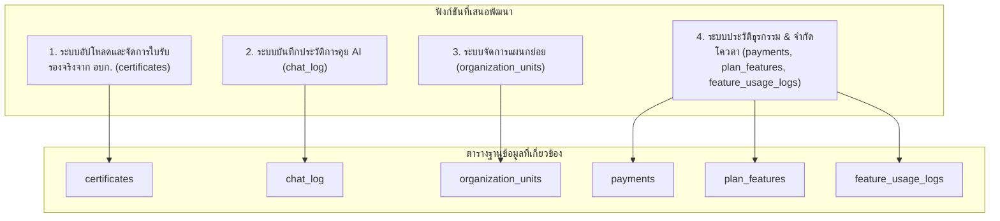

# แผนบูรณาการฐานข้อมูลและพัฒนาฟีเจอร์ระบบ Green Sync (อัปเดต)

แผนงานนี้จัดทำขึ้นเพื่อนำตารางฐานข้อมูลทั้ง 6 ตารางที่ออกแบบไว้แล้วแตยังไม่ได้นำมาใช้งาน มาร่วมพัฒนาระบบให้สมบูรณ์ โดยอัปเดตตามคอมเมนต์ของผู้ใช้งานในการแก้ไขกระบวนการออกใบรับรองจริง

---

## 📋 สรุปแผนงานและเทเบิ้ลที่นำมาใช้

เราจะพัฒนาฟังก์ชันใหม่ 4 รายการเพื่อครอบคลุม 6 ตารางที่เหลือ:

---

## 🛠️ รายละเอียดฟังก์ชันและผลกระทบของแต่ละบทบาท (Roles)

### 1. 📜 ระบบอัปโหลดและจัดการใบรับรองจาก อบก. (TGO Certificate Manager)
* **ตารางที่ใช้งาน:** `certificates` (Entity: `Certificate` - เพิ่มฟิลด์ `certificate_url` เพื่อเก็บไฟล์ใบรับรองที่อัปโหลด)
* **บทบาทผู้ใช้ (Roles):** 
  * `ASSESSOR` / `SYSTEM_ADMIN`: เมื่อองค์กรผ่านการประเมินและได้รับใบรับรองจริงจาก **อบก. (TGO)** แล้ว ผู้ตรวจประเมินจะเป็นผู้กรอกข้อมูลใบรับรอง (เช่น เลขที่ใบรับรอง, วันที่ออก, วันหมดอายุ) พร้อมกับ**อัปโหลดไฟล์ใบรับรองจริง** (PDF/Image) เข้าสู่ระบบ
  * `ORG_ADMIN` / `EXECUTIVE`: สามารถเข้ามาเปิดดูประวัติและคลิกดาวน์โหลดไฟล์ใบรับรองจริงจาก อบก. ที่ผู้ตรวจประเมินอัปโหลดให้ได้ผ่านหน้าเว็บ
* **การเปลี่ยนแปลงในระบบ:**
  * **Backend:** 
    * อัปเดต [certificate.entity.ts](file:///c:/Users/Vteca/project-green/backend/src/assessments/entities/certificate.entity.ts) เพิ่มคอลัมน์ `certificate_url`
    * พัฒนา API ใน `assessor.controller.ts` ให้สามารถบันทึกข้อมูลใบรับรองและรับไฟล์อัปโหลด
    * พัฒนา API ค้นหาและดึงไฟล์ใบรับรองสำหรับองค์กร
  * **Frontend:**
    * **หน้าประเมินของผู้ตรวจประเมิน (`/assessor/decide/:id`):** เพิ่มแบบฟอร์มให้กรอกเลขที่ใบรับรอง, วันออก/หมดอายุ และปุ่มอัปโหลดไฟล์ใบรับรองจาก อบก. เมื่อกดบันทึกและให้สถานะเป็น `APPROVED`
    * **หน้าแดชบอร์ดองค์กร (`/dashboard` และ `/executive/dashboard`):** แสดงกล่องตราสัญลักษณ์ Green Office และปุ่ม **"ดาวน์โหลดใบรับรองจริงจาก อบก. (PDF/รูปภาพ)"** เมื่อได้รับการรับรองแล้ว

---

### 2. 💬 ระบบบันทึกประวัติการแชทกับ GreenBot (AI Chat History)
* **ตารางที่ใช้งาน:** `chat_log` (Entity: `ChatLog`)
* **บทบาทผู้ใช้ (Roles):** 
  * `ORG_ADMIN`, `EMPLOYEE`, `USER`: เวลาพิมพ์ถาม-ตอบกับ GreenBot ข้อมูลจะถูกบันทึกย้อนหลัง
  * `SYSTEM_ADMIN`: สามารถเข้าตรวจดูประวัติคำถามที่พบบ่อยได้เพื่อนำไปพัฒนาข้อมูลความรู้
* **การเปลี่ยนแปลงในระบบ:**
  * **Backend:** แก้ไข `gemini.service.ts` เพื่อบันทึกคำถาม คำตอบ และระดับความมั่นใจของ AI ลงในตาราง `chat_log` หลังจากเรียก Gemini API สำเร็จ พร้อมทั้งเปิด API ดึงประวัติย้อนหลังของบัญชีผู้ใช้
  * **Frontend (เขียน UI เพิ่มเติมบนหน้าเดิม):** 
    * หน้าแชท AI `/ai-scan` หรือแถบแชท GreenBot: เพิ่มแถบ Sidebar แสดงหัวข้อแชทย้อนหลัง (Chat Sessions) ให้กดสลับไปดูประวัติการคุยเดิมได้

---

### 3. 🏢 ระบบแบ่งแผนกและกระจายสิทธิ์ตรวจวัด (Department & Unit Tracking)
* **ตารางที่ใช้งาน:** `organization_units` (Entity: `OrganizationUnit`)
* **บทบาทผู้ใช้ (Roles):** 
  * `ORG_ADMIN`: สามารถสร้างแผนกย่อย (เช่น อาคาร 1, ชั้น 2, แผนกจัดซื้อ, แผนกบัญชี) และกำหนดให้พนักงานประจำแผนกย่อยได้
  * `EMPLOYEE` / `USER`: ตอนลงข้อมูลปริมาณพลังงาน สามารถระบุได้ว่าข้อมูลชุดนี้เป็นของแผนกย่อยใด
* **การเปลี่ยนแปลงในระบบ:**
  * **Backend:** อัปเดตโครงสร้างผู้ใช้และการบันทึกคาร์บอนให้ผูกกับ `OrganizationUnit`
  * **Frontend (เพิ่มหน้า UI ย่อยและฟอร์มใหม่):**
    * **หน้าข้อมูลหน่วยงาน `/org/profile`:** เพิ่มแท็บ **"จัดการแผนก/สาขา"** ให้ Org Admin สามารถ เพิ่ม/ลบ แผนกย่อยได้
    * **หน้าบันทึก Carbon Logs `/carbon/logs`:** ปรับฟอร์มเพิ่มตัวเลือก Dropdown สำหรับเลือกแผนกย่อยขณะบันทึกข้อมูล
    * **หน้า Dashboard `/dashboard`:** เพิ่มกราฟแท่งเปรียบเทียบอัตราการใช้พลังงานและการปล่อยคาร์บอนของแต่ละแผนกย่อย

---

### 4. 💳 ระบบประวัติชำระเงินและควบคุมโควตาฟีเจอร์ (Subscriptions & AI Quota Manager)
* **ตารางที่ใช้งาน:** `payments`, `plan_features`, `feature_usage_logs`
* **บทบาทผู้ใช้ (Roles):** 
  * `ORG_ADMIN`: ดูปริมาณการใช้งาน AI Scan ที่ใช้ไปแล้ว และประวัติการทำธุรกรรมที่ผ่านระบบ Stripe หรือแบบ Offline
  * `SYSTEM_ADMIN`: ดูรายงานการจ่ายเงินรวมขององค์กรต่างๆ
* **การเปลี่ยนแปลงในระบบ:**
  * **Backend:**
    * เมื่อผู้ใช้สั่งรันฟังก์ชันที่เป็น Premium (เช่น การใช้ AI Scan) ระบบจะเช็คสิทธิ์จาก `plan_features` และนำไปเพิ่มยอดสะสมใน `feature_usage_logs`
    * เมื่อการชำระเงินผ่าน Stripe สำเร็จ ระบบจะบันทึกสถานะธุรกรรมลงสู่ตาราง `payments`
  * **Frontend (เพิ่ม UI บนหน้ารวม):**
    * ในหน้าจัดการแพ็กเกจ `/subscription` ของฝั่งลูกค้า: เพิ่มส่วนแจ้งสถานะความจุโควตา เช่น **"AI Scan ประจำเดือนนี้: 4/10 ครั้ง"**
    * แสดงประวัติการทำธุรกรรมย่อย (ยอดชำระ, วิธีการชำระ) ผ่านตารางธุรกรรมจริง

---

## 🔮 ลำดับขั้นตอนการดำเนินการ (Execution Roadmap)

#### งานที่ต้องทำต่อในเฟส 3
* Backend
  * เขียนโค้ดตรวจสอบโควตา AI Scan จาก `plan_features` ก่อนรันการสแกนบิล
  * เมื่อรันสำเร็จให้บันทึก `feature_usage_logs` และหักโควตาตามจำนวนที่ใช้
  * ป้องกันการสแกนเมื่อโควตาหมดแล้ว และคืนค่า error/message ที่ชัดเจน
  * สร้าง API ดึงข้อมูลโควตาปัจจุบันและการใช้ย้อนหลังสำหรับหน้า `/subscription`
  * สร้าง API ดึงประวัติธุรกรรมจาก `payments`
* Frontend
  * ปรับหน้า `/subscription` ให้แสดงสถานะโควตา AI Scan รายเดือน เช่น `AI Scan ประจำเดือนนี้: 4/10 ครั้ง`
  * เพิ่มส่วน UI แสดงสถานะแพ็กเกจและจำนวนครั้งที่เหลือสำหรับฟีเจอร์ที่เป็น Premium
  * เพิ่มตารางประวัติการชำระเงินย้อนหลัง พร้อมคอลัมน์ `วันที่`, `ยอดเงิน`, `สถานะ`, `ช่องทางชำระ`
  * แสดงข้อความเตือนเมื่อโควตาใกล้หมดหรือหมดแล้ว
* การทดสอบ
  * ทดสอบการสแกน AI โดยใช้แพ็กเกจที่มีโควตาจำกัด และยืนยันว่า `feature_usage_logs` ถูกเพิ่ม
  * ทดสอบการป้องกันการใช้งานเมื่อโควตาเกิน
  * ทดสอบการโหลดข้อมูลโควตาและการแสดงผลในหน้า `/subscription`
  * ทดสอบการดึงรายการ `payments` และแสดงประวัติธุรกรรมย้อนหลัง

---

## 🧪 แผนการทบทวนและตรวจสอบความถูกต้อง (Verification Plan)

### การทดสอบแบบอัตโนมัติ (Automated Tests)
* พัฒนา unit test หรือ integration test ในฝั่ง backend เพื่อตรวจสอบ:
  * ความถูกต้องของ API การบันทึกและดึงข้อมูล `chat_log`
  * การนับจำนวนการจำกัดโควตาใน `feature_usage_logs` ว่าอัปเดตตรงตามจำนวนที่เรียกใช้งานจริง

### การตรวจสอบด้วยตนเอง (Manual Verification)
* **สิทธิ์ผู้ตรวจประเมิน (Assessor):** จำลองการอัปโหลดไฟล์ใบรับรอง PDF ของ อบก. และกรอกข้อมูล จากนั้นกดอนุมัติผลประเมิน
* **สิทธิ์ผู้บริหาร/แอดมินองค์กร:** เข้าไปที่หน้า Dashboard เพื่อตรวจสอบว่าปุ่มดาวน์โหลดใบรับรองแสดงผล และลิงก์ชี้ไปยังไฟล์ PDF ที่ผู้ตรวจประเมินอัปโหลดไว้ถูกต้อง
* **ระบบแชท:** ลองแชทคุยกับ GreenBot แล้วกดรีเฟรชหน้าเว็บว่าระบบสามารถโหลดคำคุยเก่าๆ กลับมาแสดงที่แถบประวัติได้หรือไม่

---

## 🚀 แผนงานพัฒนาสำหรับวันนี้ (Phase 4: Final Polish & Testing)

จากการตรวจสอบระบบที่ได้พัฒนามาในเฟสที่ 1-3 พบว่าฟีเจอร์หลักๆ ได้ถูกรวมเข้ากับระบบเรียบร้อยแล้ว (เช่น `certificates`, `chat_log`, `organization_units`, `subscriptions`, และ `feature_usage_logs`) 

อย่างไรก็ตาม ยังมีรายละเอียดที่ต้องเก็บตกเพื่อให้ระบบมีความสมบูรณ์ 100% สำหรับการใช้งานจริง:

1. **เก็บตก TODO ที่ยังค้างอยู่ใน Backend:**
   * **[MODIFY]** `backend/src/assessments/green-office.controller.ts`: พัฒนาตรรกะการบันทึกคะแนนจริง (Actual Score Update Logic) สำหรับการประเมิน Green Office ให้บันทึกลง Database ให้ครบถ้วน
2. **การทำ End-to-End Testing ของระบบใหม่ทั้งหมด (E2E Test):**
   * ทดสอบระบบจำกัดโควตา AI Scan ตั้งแต่การอัปโหลดไฟล์ไปจนถึงการลดโควตาในฐานข้อมูล เพื่อป้องกันการทำ Bypass
   * ทดสอบการโหลดประวัติการชำระเงินและแสดงผลที่หน้าจอ Subscription อย่างถูกต้อง
   * ทดสอบการเข้าถึงแผนกย่อย (Organization Units) ผ่านหน้าบันทึก Carbon Logs ว่าทำงานร่วมกันได้ตามปกติ
3. **ตรวจสอบความปลอดภัยและการแสดงผล UI:**
   * ซ่อนข้อมูล หรือปุ่ม Premium ต่างๆ ในกรณีที่ไม่ได้เป็นสมาชิกแพ็กเกจที่กำหนด
   * ทดสอบว่า Alert แจ้งเตือนเมื่อโควตาหมดแสดงผลอย่างถูกต้องและไม่กระทบประสบการณ์ผู้ใช้
4. **ทำความสะอาดโค้ด (Refactoring & Clean up):**
   * ลบ Dummy Data และเพิ่ม Error Handling หรือ Timeout Handling ในฝั่ง API Calls ทั้งหมด

หากเห็นด้วยกับแผนการเก็บรายละเอียดเหล่านี้ เราสามารถเริ่มจัดการข้อ 1 (เรื่องระบบบันทึกคะแนน) และดำเนินการทดสอบระบบทั้งหมดในลำดับถัดไปได้เลยครับ
